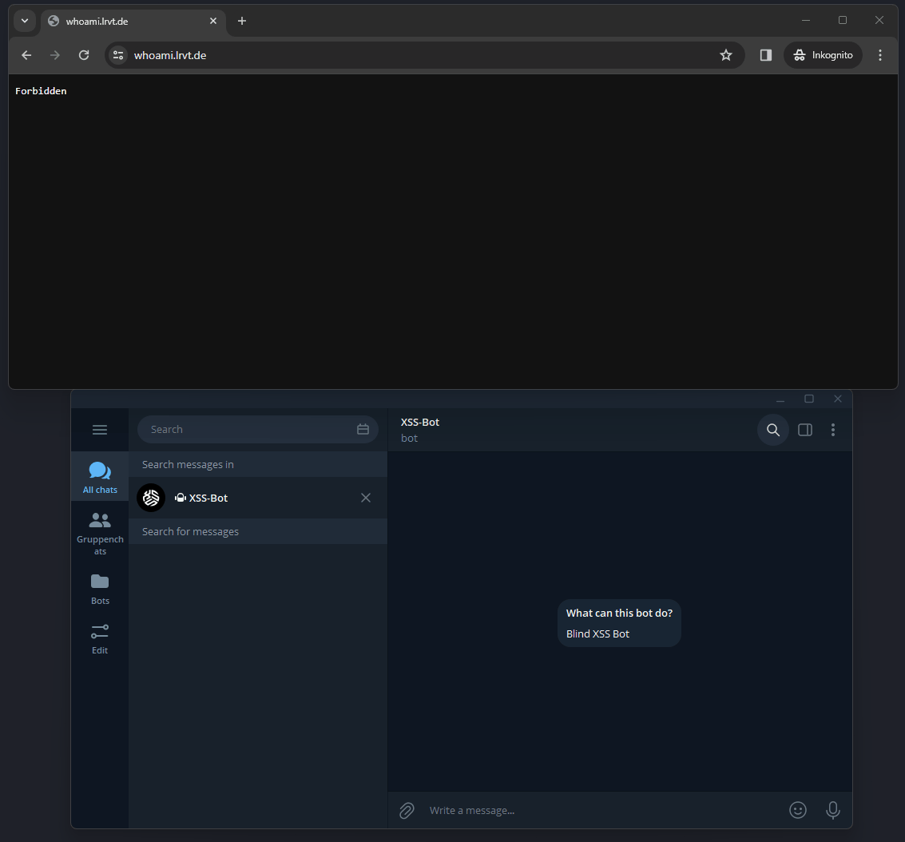

<div align="center" width="100%">
    <h1>TraefikShaper</h1>
    
    <p>Docker container to manipulate Traefik's IpAllowList middleware for dynamic IP whitelisting</p><p>
    <a target="_blank" href="https://github.com/l4rm4nd"></a>
    <a target="_blank" href="https://GitHub.com/l4rm4nd/TraefikShaper/graphs/contributors/"></a><br>
    <a target="_blank" href="https://GitHub.com/l4rm4nd/TraefikShaper/commits/"></a>
    <a target="_blank" href="https://GitHub.com/l4rm4nd/TraefikShaper/issues/"></a>
    <a target="_blank" href="https://github.com/l4rm4nd/TraefikShaper/issues?q=is%3Aissue+is%3Aclosed"></a><br>
        <a target="_blank" href="https://github.com/l4rm4nd/TraefikShaper/stargazers"></a>
    <a target="_blank" href="https://github.com/l4rm4nd/TraefikShaper/network/members"></a>
    <a target="_blank" href="https://github.com/l4rm4nd/TraefikShaper/watchers"></a><br>
    <a target="_blank" href="https://hub.docker.com/repository/docker/l4rm4nd/traefikshaper/general"></a><br><p>
    <a href="https://www.buymeacoffee.com/LRVT" target="_blank"></a>
</div>

## 🔆 How it works

This Docker container provides a Python Flask web application that handles the manipulation of a custom Traefik dynamic configuration file `dynamic-ipwhitelist.yml`. The configuration file is bind mounted into the Flask container and can therefore be manipualted through code.

Within the dynamic configuration file, an [IpAllowList](https://doc.traefik.io/traefik/middlewares/http/ipallowlist/) middleware is defined, which can be used by other containers. As it is a dynamic configuration file, Traefik can monitor it for changes and reflect those dynamically without the necessity of restarting Traefik itself or any containers behind. So if we add or remove IP addresses to the middleware, Traefik will pick them up and dynamically grant or deny access to a container service.

The Flask web application offers a custom `/knock-knock` endpoint. If this HTTP endpoint is requested, an approval link will be generated based on the IP address the request originated from. The approval link will then be sent out via a defined Apprise notification channel to an admin. The admin in this case would be the operator of the Traefik reverse proxy. The `/knock-knock` endpoint is typically requested by an external party, which initially does not have access to a container service proxied by Traefik. However, if setup correctly, the external party can access this endpoint and therefore `ask for access`. This will trigger the aforementioned procedure of creating an approval link, sending it out to the admin and waiting for approval.

If the admin would like to grant access, he must open the approval link. That's it. The approval link contains the (WAN) IP address of the external party, a secure token for authorization as well as the same random word shown previously to the external party when asking for access. The admin can instantly grant access by opening the link or first validating the random word or IP address with the external party. Once the link is opened, the (WAN) IP address of the external party is added to the IpAllowList middleware. Therefore, the external party gets temporary access to the container services proxied by Traefik that use the middleware. Access will expire after a predefined period of time. Once access is expired, the admin receives another notification and the external party the standard `403 Forbidden` HTTP error by Traefik.

Areas of use:

- Granting temporary access to web services (alternative to VPN, BasicAuth and static IP whitelists)

## 🎥 Demo



## 🔨 Setup and Usage

### Prerequisites

You have to enable and use Traefik's feature of dynamic configuration files via the `file` provider.

As we introduce a new dynamic configuration file and some of you may already use one, it is necessary to enable Traefik's [directory](https://doc.traefik.io/traefik/providers/file/#directory) configuration option for the file provider instead of relying on the `filename` parameter, which allows a single dynamic conf only. To do so, please adjust your static Traefik configuration file as follows:

````
providers:
  file:
    directory: /etc/traefik/dynamic-confs/
    watch: true
````

Then, create the new directory `dynamic-confs` at your Traefik's bind volume mount. Move all of your previously used dynamic configuration files into this new directory. The directory will be monitored by Traefik from now an and you can place any number of configuration files.

Also create a blank `dynamic-ipwhitelist.yml` file within the directory.

### Middleware Container

Now use the provided `docker-compose.yml` file and spawn up the new `traefikshaper` container.

Please adjust the Traefik labels and ensure that this container is accessible by authorized persons only.

Following environment variables are available:

| Environment Variable                | Description                                                                                                                           | Status      | Default                | Example                               |
|-----------------------------        |---------------------------------------------------------------------------------------------------------------------------------------|-------------|------------------------|---------------------------------------|
| APPURL                              | The URL of the traefikshaper application for admin approval requests.                                                                 | Optional    | http://localhost:5000  | `https://traefikshaper.example.com`   |
| GRANT_HTTP_ENDPOINT                 | The HTTP endpoint for clients to request access.                                                                                      | Optional    | /knock-knock           | `/letmein`                            |
| EXCLUDED_IPS                        | The `excludeips` ip strategy used in the `IPAllowList` middleware. Use and define IP addresses to exclude as comma-separated string.  | Optional    |                        | `103.21.244.0/22,103.22.200.0/22`     |
| IPSTRATEGY_DEPTH                    | The `depth` ip strategy used in the `IPAllowList` middleware. Use `1` if Traefik runs behind another proxy (e.g., CloudFlare).        | Optional    | 0                      | `1`                                   | 
| DEFAULT_PRIVATE_CLASS_SOURCE_RANGE  | If set to `True`, adds the private class subnets 10.0.0.0/8, 172.16.0.0/12 and 192.168.0.0/16 as default to the IPAllowList.          | Optional    | False                  | `True`                                | 
| EXPIRATION_TIME                     | Expiration time for grants in seconds.                                                                                                | Optional    | 300                    | `3600`                                |
| SECRET_KEY                          | A secret for HMAC token generation. Creates a random secret if missing.                                                               | Optional    | Randomly generated     | `MySecureSecretForTokenGen`           |
| APPRISE_NOTIFICATION_URL            | An Apprise notification url. See [here](https://github.com/caronc/apprise). If unset, only container logs will print links.           | Optional    |                        | `tgram://<BOTTOKEN>/<CHAT-ID>`        |

You can spawn it up as follows:

````
docker compose up -d
````

### Target Containers

For any target containers you wish to protect with this dynamic IP whitelisting setup, you have to add new Traefik labels:

````
      # add the new dynamic-ipwhitelist middleware, which denies access in general
      # this middleware is defined in the new file provider config /dynamic-confs/dynamic-ipwhitelist.yml
      - traefik.http.routers.CHANGEME.middlewares=dynamic-ipwhitelist@file

      # add a new route for the GRANT_HTTP_ENDPOINT endpoint; here default is /knock-knock
      # requests to this endpoint are forwarded to the `traefikshaper` container
      # this will trigger the creation of an approval link and telegram notification
      - traefik.http.routers.CHANGEME-dynamic.rule=PathPrefix(`/knock-knock`)
      - traefik.http.routers.CHANGEME-dynamic.service=traefikshaper
      - traefik.http.services.CHANGEME-dynamic.loadbalancer.server.port=5000
````

Here is an example of the infamous `whoami` container:

````
version: '3.3'

services:

  whoami:
    image: traefik/whoami
    container_name: traefikshaper-whoami
    command:
       - --name=whoami
    networks:
      - proxy
    labels:
      - traefik.enable=true
      - traefik.docker.network=proxy
      - traefik.http.routers.whoami.rule=Host(`whoami.example.com`)
      - traefik.http.routers.whoami.service=whoami
      - traefik.http.services.whoami.loadbalancer.server.port=80
      - traefik.http.routers.whoami.middlewares=dynamic-ipwhitelist@file
      - traefik.http.routers.whoami-dynamic.rule=Host(`whoami.example.com`) && PathPrefix(`/knock-knock`)
      - traefik.http.routers.whoami-dynamic.service=traefikshaper
      - traefik.http.services.whoami-dynamic.loadbalancer.server.port=5000

networks:
  proxy:
    external: true
````

Once spawned, an external party cannot access the whoami service at `https://whoami.example.com/`. The external party will receive a `403 Forbidden` error. However, the external party can browse the `https://whoami.example.com/knock-knock` endpoint, which will be forwarded to the `traefikshaper` container. On success, the external party will receive an HTTP response, stating that an admin was asked for approval. Furthermore, a random word is displayed and highlighted.

The admin, on the other hand, will receive an Apprise notification with an approval link and the random word. The admin and external party can now compare the random word, which ensures that the request originated from the external party. Furthermore, the (WAN) IP address of the external party is also included and displayed within the approval link. Once the admin opens the approval link, the (WAN) IP address of the external party will be added to the `IPAllowList` of Traefik's dynamic configuration file `dynamic-ipwhitelist@file`. The external party can now browse `https://whoami.example.com` and gain temporary access to the whoami container service. 

> [!WARNING]
>
> The TraefikShaper container is usually not exposed to the Internet.
>
> You may do so for convenient admin approvals, but I recommend accessing it locally or via VPN only.

> [!CAUTION]
>
> If your Traefik reverse proxy runs behind another proxy (e.g. CloudFlare), you must adjust the [IP strategy](https://doc.traefik.io/traefik/middlewares/http/ipwhitelist/#ipstrategy). You can either use the `depth` strategy via the environment varibale `IPSTRATEGY_DEPTH` or the `excludeips` strategy via the environment varibale `EXCLUDED_IPS`.
>
> Usually, a depth of `1` will work and select the correct client IP address for whitelisting. More details [here](https://vince.ca/posts/traefikee-ipwhitelist-behind-cloudflare/#cloudflare). If your Traefik reverse proxy is exposed directly to the Internet, you can leave the depth at the default value of `0` and ignore all available ip strategies.
> 
> Once you have enabled a depth of `1` though, local requests via split brain DNS won't work anymore. You will always receive `403 Forbidden`. Read [this](https://community.traefik.io/t/traefik-v2-ipwhitelist-depth-with-cloudflare-and-local-network/13332) for more info. You can then opt for the `excludeips` strategy and define all CloudFlare IPv4 and IPv6 addresses as comma-separated string. Those IPs will then be excluded by Traefik in the `X-Forwarded-For` HTTP header and the first IP will be used that remains. More information [here](https://www.reddit.com/r/Traefik/comments/skbjd1/comment/ima96of/?utm_source=share&utm_medium=web3x&utm_name=web3xcss&utm_term=1&utm_content=share_button). However, this likely will not resolve the issue, as stated [here](https://community.traefik.io/t/ipwhitelist-with-excludedips-setting-will-result-in-empty-ip-address-when-there-is-1-ip-address-in-x-forwarded-for-header/17491). So TraefikShaper may only work reliably behind a second proxy like CloudFlare if you use the `depth` ip strategy set to `1` and can live with the fact that local requests won't work and cannot match the IPAllowList (will always lead to `Rejecting IP : empty`). Use different routers for internal and external proxy hosts!

## 🙋 FAQ

<details>
  <summary>Can I apply multiple IPAllowList middlewares to the same container router?</summary>
    The `dynamic-ipwhitelist@file` middleware must be the single IPAllowList middleware for the container router. The reason for this is that Traefik does not merge IPAllowList source ranges. Each middleware is checked by its own and if the source IP does not match the configured source range for an IPAllowList, access is denied. The TraefikShaper container only manipulates a single IPAllowList middleware and not mutliple ones. Therefore, you have to use a single middleware that states the IPAllowList source ranges allowed. In general, you can use different routers with host rules though.
</details>

<details>
  <summary>How do I remove a falsely approved IP?</summary>
    Either restart the TraefikShaper container, which resets the middleware or manually adjust the `dynamic-whitelist.yml` dynamic configuration file.
</details>

<details>
  <summary>Can I use this container with other reverse proxies?</summary>
    No. TraefikShaper only works with the Traefik reverse proxy (v2 and v3).
</details>

<details>
  <summary>This does not work. I only receive 401 Forbidden, even after whitelisting.</summary>
    Enable Traefik debug logging and inspect the logs. You will see the reasons why the request could not pass the IpAllowList source range. Ensure that only one middleware with `IpAllowList` is in use. Also read up on the `IPSTRATEGY_DEPTH` env variable.
</details>
